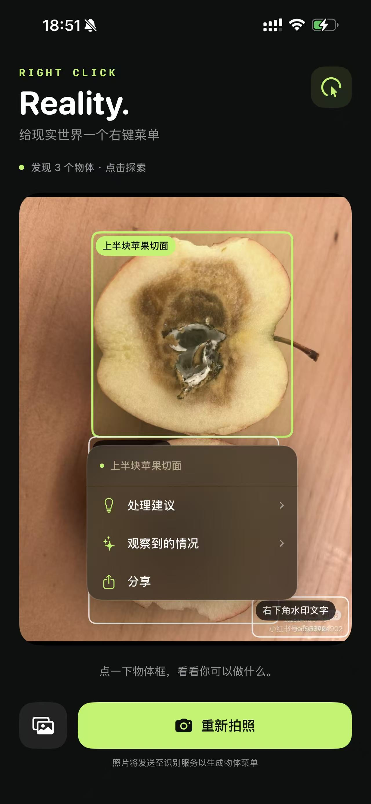
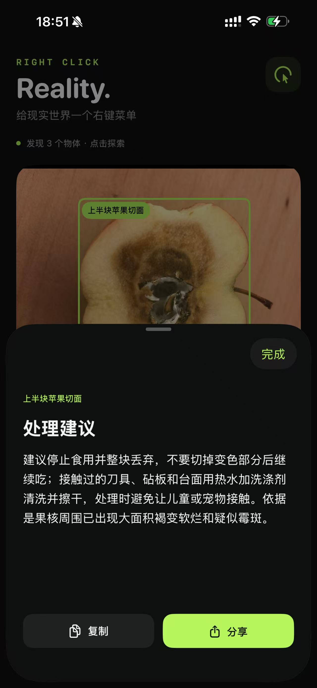
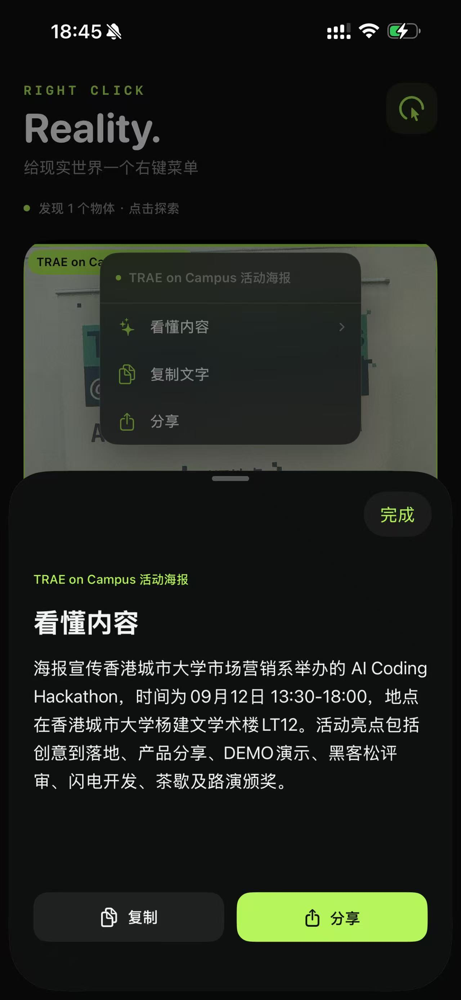
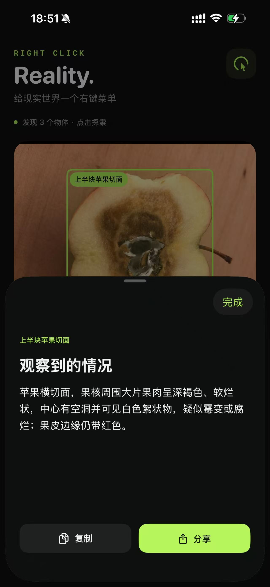
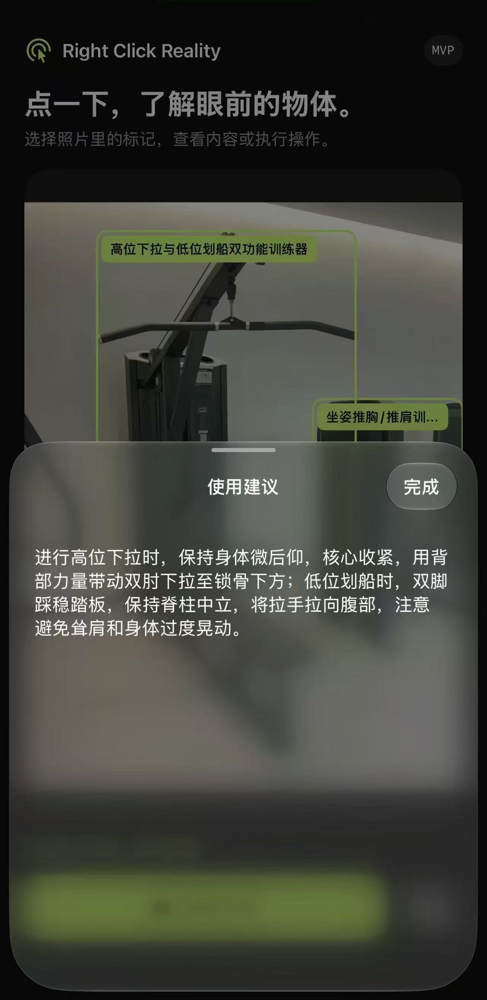

<div align="center">

# Right Click Reality

### 如果现实世界也能点击右键？

拍一张照片，点选眼前的物体，打开属于它的操作菜单。

**看见物品，理解状态，找到下一步。**

SwiftUI · iPhone · Web · DeepSeek / Gemini

</div>

## 为什么做这个项目

电脑里的文件有右键菜单，现实里的物品也可以有。

Right Click Reality 把照片变成可以探索的界面：拍照或从相册选图，AI 标出画面中的物体；点一下物体框，就能查看与它相关的说明、建议、文字或翻译，并复制、分享结果。

菜单关注的不只是物品的名称，还有它此刻的状态。面对出现异常的食物，比起介绍它通常怎么吃，更有帮助的是解释看到了什么、建议下一步怎样处理。遇到陌生的健身器械，可以获取使用提示；看到外文海报，可以读取文字、理解内容。

这个项目起源于一场字节TRAE团队香港城市大学120 分钟开发环节的黑客松，拿到了第一名🥇，并在活动后继续完善了真机体验、模型接入与针对性建议。

## 看看它如何工作

<table>
<tr>
<th>① 点选物体</th>
<th>② 获取处理建议</th>
<th>③ 理解海报内容</th>
</tr>
<tr>
<td></td>
<td></td>
<td></td>
</tr>
</table>

截图由项目作者提供，展示实际测试中的模型输出。界面和输出会随版本、照片及模型变化；截图不代表每次识别都正确。

<details>
<summary>查看更多：观察物体状态与健身器械指引</summary>
<br>



健身器械截图来自较早界面版本，展示同一交互思路。
</details>

## 有什么用

| 眼前的场景 | 可以获得的帮助 |
| --- | --- |
| 食物出现可疑变化 | 查看可见状态和处理建议，关注是否需要停止食用、进一步检查或清理 |
| 不熟悉的健身器械、日常物品 | 查看使用提示和注意事项，减少只知道名称却不知道下一步怎么做的情况 |
| 外文海报、菜单、文字牌 | 读取可辨认文字、概括内容，并在有适用内容时提供翻译 |
| 一本书 | 查看可读封面信息、复制书名或翻译封面文字 |
| 想把结果留给自己或别人 | 复制当前内容，或通过系统分享传递观察和建议 |

## 当前实现

- **iPhone 原生应用**：SwiftUI 界面、系统相机和相册、照片方向处理与压缩、物体框、上下文菜单、结果卡片、复制和分享。
- **手机浏览器版本**：无需安装 App，可在同一局域网中体验选图、物体菜单及结果展示。
- **针对状态生成建议**：普通物体优先显示处理、养护或使用建议，没有适用内容时隐藏对应动作。
- **一张照片最多三个主要物体**：每个物体有独立内容，点选后查看；这是拍照后的交互，尚未实现实时 AR 跟踪。
- **独立后端**：密钥留在服务端，支持 DeepSeek、Gemini，并保留智谱适配。当前主要验证模型为 `deepseek-flash`。
- **有界等待和重试**：DeepSeek / Gemini 的 503 可在总时限内重试，支持取消和换图，失败不会自动伪装成示例结果。

网页中的内置交互示例明确标注为人工样例，不调用模型。

## 快速运行

需要 Node.js 20.12 或更新版本。iOS 开发还需要完整 Xcode、可用的 iOS 平台组件和开发签名账户。

### 1. 配置后端

```sh
git clone https://github.com/why5292/right-click-reality.git
cd right-click-reality
cp backend/.env.example backend/.env
```

编辑 `backend/.env`，以 DeepSeek 为例：

```dotenv
VISION_PROVIDER=deepseek
DEEPSEEK_API_KEY=填写自己的密钥
DEEPSEEK_MODEL=deepseek-flash
HOST=0.0.0.0
PORT=8787
REQUEST_TIMEOUT_MS=60000
```

后端不需要安装第三方 npm 依赖，直接启动：

```sh
cd backend
npm start
```

电脑打开 **http://localhost:8787** 即可体验网页。`/health` 返回配置状态，但不代表模型调用一定成功。照片会由后端发送给选定的模型服务，调用费用和可用性由相应服务商决定。

要使用 Gemini，把 `VISION_PROVIDER` 改为 `gemini`，填写 `GEMINI_API_KEY` 和支持图片输入的 `GEMINI_MODEL`。修改配置后重启后端即可，手机不需要因更换模型而重新安装。

### 2. 在 iPhone 运行

1. 打开 `ios/RightClickReality.xcodeproj`。
2. 将 `ios/Configuration/Local.xcconfig.example` 复制为同目录下的 `Local.xcconfig`。
3. 填写自己的开发团队和手机可访问的后端地址。手机与 Mac 使用同一 Wi-Fi；可以在 Mac 运行 `scutil --get LocalHostName` 查看主机名。
4. 连接 iPhone，在 Xcode 选择设备并运行。按系统提示完成开发者模式、开发者信任以及相机和本地网络权限。

本地配置示例（xcconfig 中的特殊写法用于避免 `//` 被当成注释）：

```xcconfig
RCR_BACKEND_URL = http:/$()/YOUR_MAC_NAME.local:8787
DEVELOPMENT_TEAM = YOUR_TEAM_ID
```

手机上的 `localhost` 指向手机自身，不能用于连接 Mac。Mac 上的后端需要保持运行；部分公共 Wi-Fi 的设备隔离也会阻止访问。

### 3. 验证与测试

从项目根目录运行：

```sh
# 后端测试，使用模拟的模型响应；无需真实 API 密钥
node --test backend/test/*.test.mjs

# macOS 上检查后端、Swift 核心逻辑与工程配置
sh scripts/check.sh

# 使用当前模型真实识别参考海报，会发生 API 调用
node backend/smoke.mjs
```

目前 24 项后端测试和 18 项 Swift 核心检查通过；iOS 已完成签名构建、安装和真机使用。一次本机 DeepSeek 海报请求约 1.83 秒成功返回，这只是单次测量，不是速度承诺。更多验证边界见 [VERIFICATION.md](VERIFICATION.md)。

## 它如何连接起来

```text
iPhone / 浏览器
  → 拍照或选图，压缩图片
  → Node.js 后端调用视觉模型
  → 校验物体框、文字、观察与建议
  → 在照片上显示物体框
  → 点选菜单，查看 / 复制 / 分享
```

```text
backend/       模型适配、输入与结果校验、HTTP 服务及测试
ios/           SwiftUI 应用与 Xcode 工程
web/           浏览器版本与明确标注的人工示例
scripts/       Swift 核心检查与工程辅助脚本
docs/images/   项目截图
```

## 当前边界

模型可能误认物体、框错位置、把水印当成独立目标，或补全照片中看不清的文字。多物体选择和细小文字仍有改进空间。

照片无法确定食品气味、内部微生物或保存条件，也无法替代健身器械说明和现场指导。应用展示的是基于可见信息的辅助建议，不是食品安全认证、故障诊断或个性化训练处方。

后端目前面向本机和可信局域网演示，没有用户认证或公网滥用防护。公开源码不等于已经部署了公开服务。

## 配置与文档

`.env`、各类 `.env.*`（配置模板除外）、本地 Xcode 配置、签名证书、构建产物和日志均已加入 `.gitignore`。仓库只提供空密钥模板。

- [产品需求与项目演进](PRD.md)
- [DeepSeek 接入和实测](DEEPSEEK.md)
- [状态建议的设计](STATE-ADVICE.md)
- [验证记录](VERIFICATION.md)

API 参考：[DeepSeek](https://api-docs.deepseek.com/) · [Gemini](https://ai.google.dev/gemini-api/docs)
